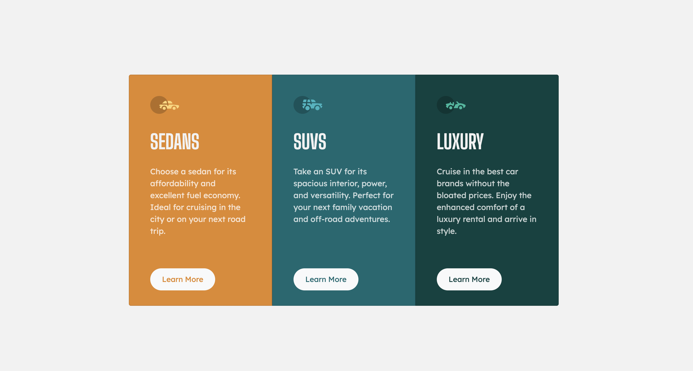

# Frontend Mentor - 3-column preview card component solution

This is a solution to the [3-column preview card component challenge on Frontend Mentor](https://www.frontendmentor.io/challenges/3column-preview-card-component-pH92eAR2-). Frontend Mentor challenges help you improve your coding skills by building realistic projects.

## Table of contents

- [Overview](#overview)
  - [The challenge](#the-challenge)
  - [Screenshot](#screenshot)
  - [Links](#links)
- [My process](#my-process)
  - [Built with](#built-with)
  - [What I learned](#what-i-learned)
  - [Continued development](#continued-development)
  - [Useful resources](#useful-resources)
- [Author](#author)

## Overview

### The challenge

Users should be able to:

- View the optimal layout depending on their device's screen size
- See hover states for interactive elements

### Screenshot

### Links

- Solution URL: [Three Column Card](https://mollibeth.dev/three-column-card)

## My process

### Built with

- HTML5 markup
- CSS custom properties
- Bootstrap Grid and Flexbox
- [Bootstrap](https://getbootstrap.com/)

### What I learned

I used this challenge to practice the Bootstrap CSS framework as well as custom CSS to render a website matching the design files as closely as possible. The Bootstrap grid system using rows and columns creates a fully responsive website using flexbox. I was able to implement the system to render the desktop and mobile view without writing media queries in my custom CSS file.

### Continued development

To improve this site, I would change the HTML to be more accessible for screen-readers. I'd like to look into how to use Bootstrap in conjunction with semantic HTML to clearly define meaning to each element.

### Useful resources

- [Bootstrap Docs](https://getbootstrap.com/docs/5.2/layout/grid/) - Always reference the documentation.

## Author

- Website - [Mollibeth Cardwell](https://www.mollibeth.dev)
